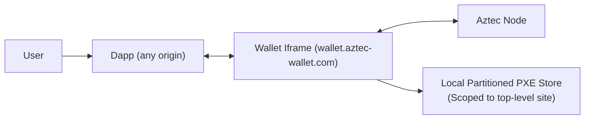

# Iframe Embedded Wallet for Aztec: Technical Design (v0)

**Date**: 2026-03-25  
**Status**: Draft (Research + Design)  
**Audience**: Wallet SDK maintainers, iframe host maintainers, integrator dapps  
**Goal**: Define a dapp-agnostic embedded wallet package for Aztec that works locally in browser environments without requiring backend state services.

---

## 1. Scope and Design Principles

### In scope
- A reusable package that any dapp can integrate.
- Wallet runtime hosted as an iframe.
- Local-only operation for wallet state (no required server state).
- Passkey-driven UX and account access.
- Security and UX model for signing, simulation, and transaction submission.

### Out of scope (v0 baseline)
- Global shared full PXE database across all dapp origins.
- Mandatory backend relay/state service.
- Cross-device sync beyond what passkey providers already offer.

### Design principles
- **Cross-browser correctness first** (Chrome/Firefox/Safari baseline behavior).
- **No-server invariant** for core wallet state.
- **Security over convenience** for writes and approvals.
- **Dapp-agnostic integration** (minimal assumptions about host app stack).

---

## 2. Problem Statement

We want a single embedded wallet experience across many dapps, but browsers partition third-party storage by top-level site.  
If `wallet.aztec-wallet.com` is embedded in multiple dapps, each embedding context gets separate storage by default.

For Aztec, PXE state is heavy (notes, nullifiers, sync state, proving data). Therefore storage behavior is a first-order architecture constraint.

---

## 3. Browser Reality (Decision Constraint)

### Key constraint
In iframe-only mode, storage is partitioned by at least:
- iframe origin
- top-level site

This means:
- `wallet.aztec-wallet.com` inside `app-a.com` != `wallet.aztec-wallet.com` inside `app-b.com` (different DB partitions)

### Why this matters
The architecture cannot assume one physically shared IndexedDB for all dapps across all browsers.

### Primary references
- Chrome: [Storage Partitioning](https://privacysandbox.google.com/cookies/storage-partitioning)
- Firefox: [MDN State Partitioning](https://developer.mozilla.org/en-US/docs/Web/Privacy/Guides/State_Partitioning)
- WebKit: [Tracking Prevention](https://webkit.org/tracking-prevention/)
- WebKit: [Updates to Storage Policy](https://webkit.org/blog/14403/updates-to-storage-policy/)
- MDN: [StorageAccessHandle.indexedDB (Limited availability)](https://developer.mozilla.org/en-US/docs/Web/API/StorageAccessHandle/indexedDB)

---

## 4. Architecture Decision

### Decision
Adopt **per-dapp partitioned PXE storage** as baseline architecture for v1.

### What "universal" means in v1
- **Shared identity** across dapps (same user/passkey/account intent).
- **Not shared full PXE state** across dapp origins.

### Consequence
- First visit to a new dapp may require PXE bootstrap/sync for that partition.
- Return visits to same dapp should benefit from warm local cache (subject to browser behavior/eviction).

---

## 5. High-Level System Model



### Trust boundaries
- Dapp and wallet iframe are separate execution contexts.
- Signing/auth logic remains in wallet runtime, not dapp runtime.
- Dapp interacts through explicit RPC over `postMessage`.

---

## 6. Package Topology (Dapp-Agnostic)

### `@aztec/embedded-wallet-sdk` (integrated by dapps)
- Bootstraps iframe.
- Handles RPC client, request correlation, timeout/retry, typed API.
- Exposes wallet methods to dapp (`connect`, `simulate`, `sendTx`, `getBalance`, etc.).

### `@aztec/embedded-wallet-host` (served at wallet origin)
- Runs PXE runtime.
- Manages passkey/auth/session flows.
- Performs simulation/proving/submission.
- Manages local partitioned storage.

### Optional future package
- `@aztec/embedded-wallet-compat` for browser-specific feature detection and graceful fallbacks.

---

## 7. Core Protocol (Dapp <-> Iframe)

Use strict postMessage RPC envelope:

```ts
type RpcRequest = {
  id: string;
  method: string;
  params: unknown;
  version: "1.0";
};

type RpcResponse = {
  id: string;
  result?: unknown;
  error?: { code: string; message: string; data?: unknown };
  version: "1.0";
};
```

### Security requirements
- Exact origin allowlist checks on both sides.
- No wildcard `targetOrigin`.
- Session binding (dapp-origin + account + network).
- Anti-clickjacking posture for approval UI.

---

## 8. State Model

### Local state per dapp partition
- Full PXE DB (notes/nullifiers/sync data/proving caches).
- Local wallet session metadata for that partition.

### No global full state in v1
- No assumption of one shared DB across all dapps.
- Any browser-specific unpartitioned storage capability is an optimization path only.

---

## 9. Major Risks and Mitigations

### Risk A: State divergence across dapps
Different dapps can be at different sync heights temporarily.

Mitigations:
- Freshness gate before writes/signing.
- Explicit stale/syncing UI states.
- Auto-resync trigger on failed/stale transaction attempts.

### Risk B: Slow first-use on new dapp partition
Mitigations:
- Incremental sync pipeline.
- Progressive readiness (read-only first, write-ready after freshness threshold).
- Instrument p50/p95 cold/warm startup.

### Risk C: Storage eviction/quota issues
Mitigations:
- Storage pressure detection + graceful degradation.
- Cache budget controls.
- Recovery path that can rebuild from chain state.

### Risk D: Browser feature variance
Mitigations:
- Runtime capability detection.
- Strict fallback matrix.
- Avoid correctness dependence on non-baseline APIs.

---

## 10. UX Contract

### What users can expect
- "Use one wallet identity across dapps."
- First visit to a dapp may sync.
- Writes can be temporarily blocked while catching up (to avoid stale-state failures).

### What users should not expect (v1)
- Instant, perfectly synchronized balances/history across every dapp at all times.
- Guaranteed shared local cache across unrelated dapp domains.

---

## 11. Browser Support Position (as of 2026-03-25)

- Baseline behavior assumes partitioned third-party storage.
- Storage Access API non-cookie storage is non-baseline across browsers.
- Therefore architecture correctness must hold without unpartitioned shared IndexedDB.

References:
- [MDN StorageAccessHandle.indexedDB](https://developer.mozilla.org/en-US/docs/Web/API/StorageAccessHandle/indexedDB)
- [Can I use: StorageAccessHandle.indexedDB](https://caniuse.com/mdn-api_storageaccesshandle_indexeddb)

---

## 12. Milestones (Design-to-Execution)

### Phase 0: Research hardening
- Finalize browser matrix and constraints.
- Define exact v1 promises in product language.

### Phase 1: Protocol + host skeleton
- RPC protocol, origin checks, iframe lifecycle.
- Capability detection and baseline fallback behavior.

### Phase 2: PXE integration baseline
- Partitioned local store per dapp.
- Sync lifecycle + freshness gate for writes.

### Phase 3: Passkey integration
- Passkey auth flows and account lifecycle.
- Reconnection UX and failure modes.

### Phase 4: Performance hardening
- Sync/proving benchmarks by browser/device.
- Optimize startup and memory pressure handling.

---

## 13. Open Questions (Still Required Before Final ADR)

1. Minimum acceptable p50/p95 cold-start and write-readiness per browser/device class?
2. Exact write freshness threshold policy (`head - n`) for safety vs UX?
3. Should Safari be first-class parity or explicitly degraded for v1?
4. Should Chrome-only unpartitioned storage path be implemented in v1, or deferred?
5. Which operations must always require explicit user approval vs policy/session key execution?

---

## 14. ADR Summary (Current)

- **Accepted**: v1 baseline uses partitioned per-dapp PXE storage.
- **Accepted**: v1 correctness does not depend on shared unpartitioned IndexedDB.
- **Accepted**: package is dapp-agnostic and local-first.
- **Deferred**: browser-specific shared storage optimization paths.
- **Deferred**: multi-context global coordination state beyond iframe-only baseline.
