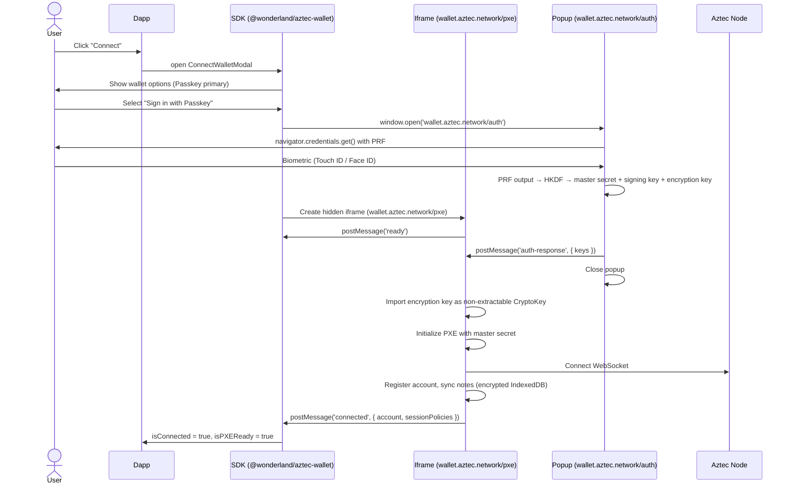
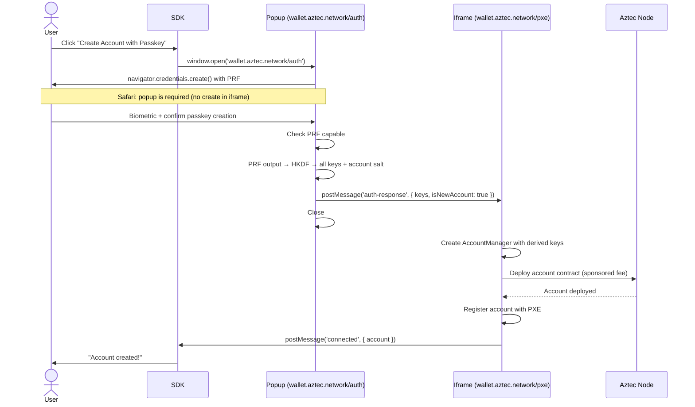
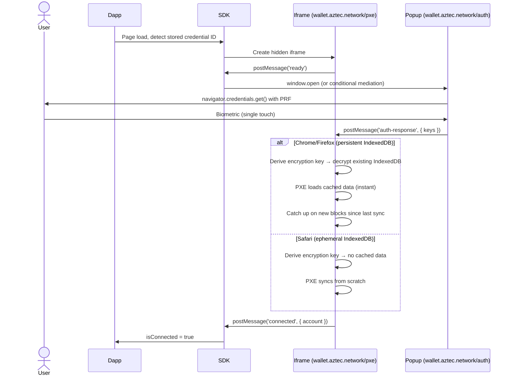
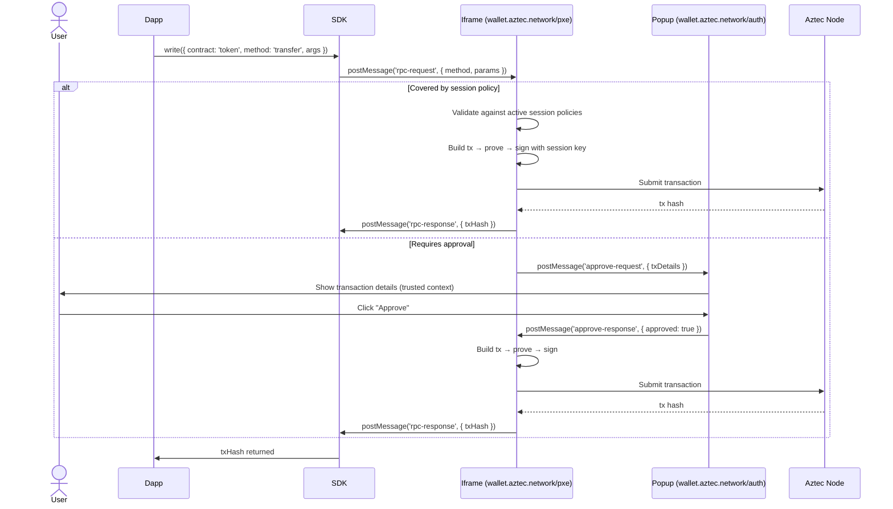
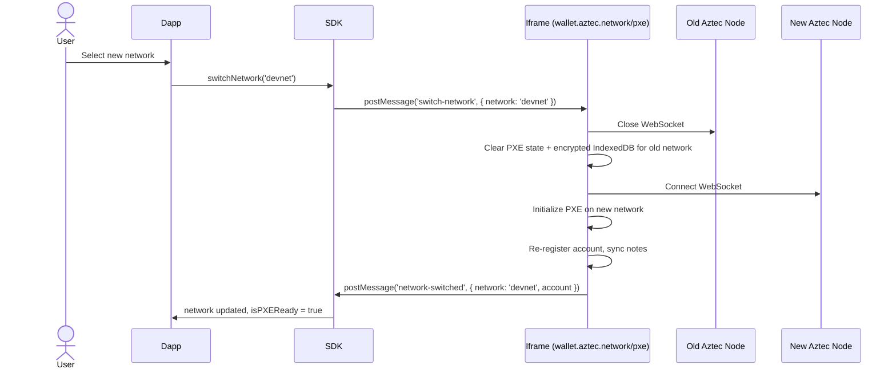
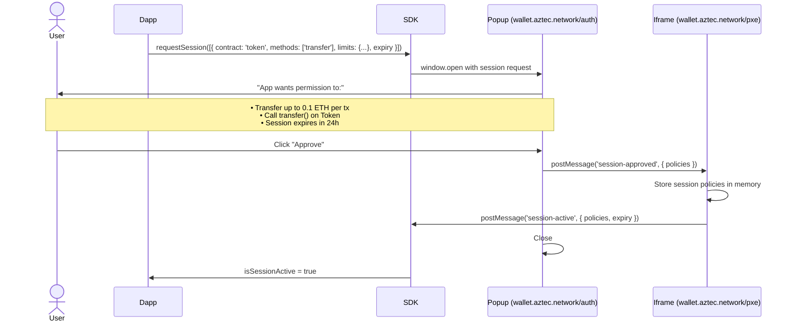

# Iframe PXE Wallet — Engineering Spec

**Date**: 2026-03-26
**Status**: Draft
**Companion doc**: [Technical Design Research](./iframe-pxe-wallet-tech-design.md)

---

## Table of Contents

1. [Scope](#1-scope)
2. [Definitions](#2-definitions)
3. [Goals](#3-goals)
4. [Non-Goals](#4-non-goals)
5. [Requirements](#5-requirements)
6. [API Definitions](#6-api-definitions)
7. [Components](#7-components)
8. [Flows](#8-flows)
9. [Session Keys](#9-session-keys)
10. [PostMessage Protocol](#10-postmessage-protocol)
11. [Wallet Host](#11-wallet-host)
12. [Open Questions](#12-open-questions)

---

## 1. Scope

**`@wonderland/aztec-wallet`** is a universal Aztec wallet delivered as an embeddable iframe — functionally equivalent to a browser extension wallet (like MetaMask) but with zero install.

Dapps embed a thin SDK. The SDK spawns a hidden cross-origin iframe (`wallet.aztec.network`) that runs the full PXE — WASM proving, note scanning, key management, and network communication. Users authenticate with passkeys (biometric). **Dapps never have access to keys or private data.**

The iframe IS the wallet. The dapp is just a UI.

```
┌──────────────────────────────────────────────────────────┐
│  Dapp (any-app.com)                                       │
│                                                            │
│  @wonderland/aztec-wallet SDK                              │
│  ┌──────────────────────────────────────────────────┐     │
│  │  React hooks + Comlink RPC proxy                   │     │
│  │  useAztecWallet, useReadContract, useWriteContract │     │
│  └────────┬───────────────────────┬──────────────────┘     │
│           │ postMessage            │ postMessage             │
│           ▼                        ▼                         │
│  ┌─────────────────┐    ┌───────────────────────┐          │
│  │  Hidden iframe   │    │  Popup (when needed)   │          │
│  │  wallet.aztec.   │    │  wallet.aztec.         │          │
│  │  network/pxe     │    │  network/auth          │          │
│  │                  │    │                        │          │
│  │  • PXE engine    │    │  • Passkey create/sign │          │
│  │  • WASM proving  │    │  • PRF key derivation  │          │
│  │  • Note sync     │    │  • Tx approval UI      │          │
│  │  • Encrypted IDB │    │  • Session requests    │          │
│  │  • WS → Node     │    │                        │          │
│  └─────────────────┘    └───────────────────────┘          │
└──────────────────────────────────────────────────────────┘
```

This library replaces the current embedded wallet and browser wallet connectors with a single iframe-based architecture that provides:
- **Key isolation**: Cross-origin iframe = separate OS process. Dapp code cannot access keys.
- **Universal identity**: One passkey, one account, every dapp. Passkey RP ID = `aztec.network`.
- **Passkey authentication**: Biometric login, no passwords, no seed phrases, deterministic key recovery.
- **Encrypted storage**: AES-256-GCM with non-extractable WebCrypto keys for all PXE data at rest.

---

## 2. Definitions

| Term | Definition |
|------|-----------|
| **PXE** | [Private Execution Environment](https://docs.aztec.network/developers/docs/foundational-topics/pxe) — client-side component that executes private functions, manages private state, and generates ZK proofs |
| **Fee Juice** | [Aztec's native gas token](https://docs.aztec.network/developers/docs/foundational-topics/fees#what-is-fee-juice) used to pay transaction fees |
| **FPC** | [Fee Paying Contract](https://docs.aztec.network/developers/docs/aztec-js/how_to_pay_fees#fee-payment-contracts-fpc) — sponsors fees in exchange for a different token |
| **Account Contract** | [Aztec smart contract](https://docs.aztec.network/developers/docs/foundational-topics/accounts) defining how an account authenticates (Schnorr, ECDSA, etc.) |
| **Passkey** | FIDO2/WebAuthn credential using P-256 curve. Private key lives in device secure enclave (Touch ID, Windows Hello, etc.) |
| **PRF** | Pseudo-Random Function — WebAuthn extension that derives deterministic 32-byte output from a passkey + salt. Used for key derivation. |
| **RP ID** | Relying Party Identifier — the domain a passkey is bound to. Our RP ID is `aztec.network`. |
| **Session Key** | Time-limited, scope-limited signing permission. Allows the iframe to auto-execute approved operations without biometric prompt. |
| **Session Policy** | Rule defining what a session key can do: which contracts, which methods, spending limits, expiry time. |
| **AMK** | Account Master Key — random 32 bytes from which all Aztec keys are derived. Encrypted per-passkey for multi-passkey support (Model B). |
| **DIP** | Document-Isolation-Policy — HTTP header allowing an iframe to independently opt into cross-origin isolation (SharedArrayBuffer) without parent headers. Chrome 137+. |
| **Non-extractable CryptoKey** | A WebCrypto key object whose raw bytes cannot be exported to JavaScript, even via DevTools. Used for IndexedDB encryption. |

---

## 3. Goals

### P0 — Non-negotiable

1. **Keys never accessible to dapp code.** The cross-origin iframe is the security boundary. Signing keys, master secrets, and decrypted note data exist only inside the iframe process.

2. **Universal wallet identity.** One passkey = one account address across all dapps. Passkey RP ID = `aztec.network`. Keys deterministically derived via PRF + HKDF.

3. **Cross-browser support.** Works on Chrome, Firefox, Safari with graceful degradation. Popup fallback for Safari WebAuthn limitations. Single-threaded proving fallback when DIP is unavailable.

4. **Fully local PXE.** All computation (proving, note scanning, state management) happens client-side. No server-side relay, cache, or delegation. Privacy is non-negotiable.

### P1 — Important

5. **Passkey authentication.** Biometric login (Touch ID, Face ID, fingerprint). No passwords, no seed phrases. PRF-based deterministic key derivation.

6. **Encrypted IndexedDB.** AES-256-GCM via WebCrypto with non-extractable keys. All PXE data encrypted at rest. Keys derived from passkey PRF.

7. **Session keys.** Dapps request pre-approved permissions (contracts, methods, limits). Approved operations execute without biometric prompt for the session duration.

8. **Transaction approval in trusted context.** Approval UI rendered in popup/dialog at `wallet.aztec.network` — dapp cannot fake transaction details. User sees the real URL.

### P2 — Future

9. **Multi-passkey support.** Multiple passkeys per account via Model B (AMK encrypted per-passkey). Enables hardware key backup, cross-platform recovery.

10. **Fee payment selection.** Fee Juice and FPC support, configurable per-dapp.

11. **Network switching.** Handle PXE teardown, cache invalidation, account re-registration transparently.

### P3 — Deferred

12. **Direct WebAuthn signing (Tier 2).** Custom Noir contract verifying WebAuthn envelope for per-transaction biometric confirmation. Requires custom account contract.

13. **Social recovery.** Guardian-based key rotation via account contract.

14. **Passkey portability.** Cross-ecosystem transfer when FIDO CXP/CXF matures.

---

## 4. Non-Goals

- **Server-side PXE cache** — violates Aztec's privacy model (metadata leakage)
- **Shared PXE state across dapps** — browser storage partitioning makes this impossible; we accept per-dapp sync
- **Mobile ZK proving** — iPhone OOMs on proof generation; mobile is read-only for now
- **Backward compatibility with current localStorage keys** — the iframe wallet is a new architecture, not an upgrade of the embedded wallet
- **Custom Noir account contract at launch** — use forked EcdsaRAccountContract (Tier 1 PRF approach); defer Tier 2 WebAuthn contract
- **Support for non-passkey authentication** — passkey is the primary auth; embedded wallet with random keys exists as a separate connector for PRF-unsupported platforms (Windows Hello without hardware key)

---

## 5. Requirements

**1. Zero-install wallet** — dapps install the SDK package, users authenticate with a biometric. No browser extension, no download, no seed phrase.

```tsx
import { AztecWalletProvider, ConnectButton } from '@wonderland/aztec-wallet';

function App() {
  return (
    <AztecWalletProvider config={config}>
      <ConnectButton />
      <MyDapp />
    </AztecWalletProvider>
  );
}
```

**2. Configuration-driven setup** — declare networks, fee options, and wallet host in a single config.

```typescript
const config = createAztecWalletConfig({
  walletHost: 'https://wallet.aztec.network',
  networks: [
    { name: 'devnet', nodeUrl: 'https://devnet.aztec.network' },
    { name: 'sandbox', nodeUrl: 'http://localhost:8080' },
  ],
  fees: {
    default: 'native',
    fpc: [{ name: 'Banana FPC', address: '0x...', tokenAddress: '0x...' }],
  },
});
```

**3. Key isolation** — dapp JavaScript must never have access to signing keys, master secrets, or decrypted notes. Enforced by cross-origin iframe boundary (separate OS process via Site Isolation).

**4. Deterministic key recovery** — the same passkey + same PRF salt always reproduces the same account (address, keys, salt). Users can recover their wallet on any device that has the synced passkey.

**5. Encrypted data at rest** — all PXE IndexedDB data encrypted with AES-256-GCM using a non-extractable WebCrypto key derived from passkey PRF. Master secret keys must never exist as plaintext in persistent storage.

**6. Session keys for headless operations** — read operations (balance, simulate, note scan) execute without user prompt. Write operations within approved session policies execute without prompt. Operations outside policies trigger the approval popup.

**7. Persistent sessions** — returning to a dapp triggers a single biometric prompt to re-derive keys. On Chrome/Firefox (persistent IndexedDB), PXE data loads from cache instantly. On Safari (ephemeral), PXE re-syncs from node.

**8. Hooks API + component library** — drop-in components for common flows (connect, approve, account management) or composable hooks for custom UIs.

---

## 6. API Definitions

### Configuration

```typescript
interface AztecWalletConfig {
  // The wallet host domain (serves iframe + popup)
  walletHost: string;  // e.g., 'https://wallet.aztec.network'

  // Networks the app supports
  networks: NetworkConfig[];

  // Fee payment configuration
  fees: {
    default: FeeMethod;      // 'native' | 'fpc'
    fpc: FPCConfig[];        // Available Fee Paying Contracts
  };

  // Optional overrides
  passkey?: {
    rpName?: string;         // Display name in passkey prompt (default: 'Aztec Wallet')
    prfSalt?: string;        // Custom PRF salt (default: 'aztec-wallet/v1')
  };

  // Session key defaults
  session?: {
    defaultExpiry?: number;  // Session duration in seconds (default: 86400 = 24h)
  };
}

interface NetworkConfig {
  name: string;              // Network identifier ('sandbox', 'devnet')
  displayName?: string;      // Human-readable name
  nodeUrl: string;           // Aztec node URL
  proverEnabled?: boolean;   // Whether proofs are generated (default: true)
  isTestnet?: boolean;       // Whether this is a test network (default: false)
}

interface FPCConfig {
  name: string;              // Display name ('Banana FPC')
  address: string;           // FPC contract address
  tokenAddress: string;      // Token the FPC accepts as payment
}

type FeeMethod = 'native' | 'fpc' | 'sponsored';
```

### Hooks

#### `useAztecWallet()`

Primary hook for wallet state and connection.

| Property | Type | Description |
|----------|------|-------------|
| `isConnected` | `boolean` | Whether a wallet is connected and PXE is ready |
| `isConnecting` | `boolean` | Whether connection is in progress (passkey + PXE init) |
| `isPXEReady` | `boolean` | Whether the iframe PXE is initialized and synced |
| `isSyncing` | `boolean` | Whether PXE is currently syncing notes from node |
| `syncProgress` | `number \| null` | Sync progress 0-100 if available |
| `account` | `AztecAddress \| null` | Connected account address |
| `walletType` | `'passkey' \| 'embedded' \| 'browser_wallet' \| null` | Active wallet type |
| `error` | `Error \| null` | Last error |
| `connect()` | `() => Promise<void>` | Connect via passkey (opens popup for auth) |
| `disconnect()` | `() => Promise<void>` | Disconnect and clear session |

**Not exposed**: `getPXE()`, `getWallet()`, or any direct access to the PXE instance. All PXE operations go through `useReadContract` / `useWriteContract` which route via postMessage to the iframe.

#### `useReadContract()`

Read data from a contract via the iframe PXE.

```typescript
const { data, isLoading, error, refetch } = useReadContract({
  contract: 'token',
  method: 'balance_of_public',
  args: [address],
});
```

| Property | Type | Description |
|----------|------|-------------|
| `data` | `T \| undefined` | Decoded return value |
| `isLoading` | `boolean` | Whether the read is in progress |
| `error` | `Error \| null` | Read error |
| `refetch` | `() => Promise<void>` | Re-execute the read |

Reads execute **headlessly** — no user prompt, no popup. The iframe PXE simulates the call and returns the result.

#### `useWriteContract()`

Send a transaction via the iframe PXE.

```typescript
const { write, isLoading, error, txHash } = useWriteContract();

await write({
  contract: 'token',
  method: 'transfer',
  args: [to, amount],
});
```

| Property | Type | Description |
|----------|------|-------------|
| `write` | `(params) => Promise<string>` | Send a transaction |
| `isLoading` | `boolean` | Whether tx is being built/proven/sent |
| `isPendingApproval` | `boolean` | Whether waiting for user approval in popup |
| `error` | `Error \| null` | Transaction error |
| `txHash` | `string \| null` | Transaction hash after submission |

If the operation is covered by an active session policy, it executes **headlessly**. Otherwise, the **approval popup** opens showing transaction details.

#### `useNetwork()`

Network state and switching.

| Property | Type | Description |
|----------|------|-------------|
| `network` | `NetworkConfig \| null` | Current network |
| `networks` | `NetworkConfig[]` | All configured networks |
| `isSwitching` | `boolean` | Whether a network switch is in progress |
| `switchNetwork` | `(name: string) => Promise<void>` | Switch to a different network |

#### `useFees()`

Fee payment method selection.

| Property | Type | Description |
|----------|------|-------------|
| `feeMethod` | `FeeMethod` | Current fee payment method |
| `setFeeMethod` | `(method: FeeMethod) => void` | Change fee method |
| `availableFPCs` | `FPCConfig[]` | Configured FPCs |
| `selectedFPC` | `FPCConfig \| null` | Currently selected FPC |

#### `useSession()`

Session key management.

| Property | Type | Description |
|----------|------|-------------|
| `activePolicies` | `SessionPolicy[]` | Currently approved session policies |
| `isSessionActive` | `boolean` | Whether an active session exists |
| `sessionExpiry` | `number \| null` | Unix timestamp when session expires |
| `requestSession` | `(policies: SessionPolicy[]) => Promise<void>` | Request session approval (opens popup) |
| `revokeSession` | `() => void` | Revoke current session |

```typescript
interface SessionPolicy {
  type: 'contract-call';
  contract: string;          // Contract name or address
  methods: string[];         // Allowed method names
  limits?: {
    maxPerTx?: bigint;       // Max value per transaction
    maxPerSession?: bigint;  // Max total value for session
  };
  expiry: number;            // Unix timestamp
}
```

---

## 7. Components

### Modals

| Component | Hook | Description |
|-----------|------|-------------|
| `ConnectWalletModal` | `useConnectModal()` | Wallet type selection → passkey flow or legacy options |
| `PasskeyModal` | `usePasskeyModal()` | Passkey creation or sign-in. Shows biometric prompt state. |
| `ApprovalModal` | `useApprovalModal()` | Transaction details in trusted context (popup). Approve/Reject. |
| `SessionRequestModal` | `useSessionModal()` | Session key permission request. Shows what the dapp is asking for. |
| `AccountModal` | `useAccountModal()` | Account details, passkey info, fee method selection |
| `NetworkModal` | `useNetworkModal()` | Network selection and switching |

### Standalone

| Component | Description |
|-----------|-------------|
| `ConnectButton` | All-in-one button — adapts to current state (disconnected → connect, connecting → spinner, connected → account info) |
| `NetworkPicker` | Inline network selector |
| `SyncIndicator` | Shows PXE sync progress (useful during first load per dapp) |

### Modal Behavior

- **ConnectWalletModal** renders in the dapp context (SDK component)
- **ApprovalModal** and **SessionRequestModal** render in the **popup** at `wallet.aztec.network/auth` (trusted context — user sees the real URL)
- **PasskeyModal** triggers the browser's native WebAuthn prompt (rendered by the OS, not by us)

---

## 8. Flows

### 8.1 Connect Account (Passkey)



### 8.2 First-Time Account Creation (Passkey)



### 8.3 Return Visit (Session Restore)



### 8.4 Send Transaction



### 8.5 Switch Network



### 8.6 Request Session Keys



---

## 9. Session Keys

### Design

Session keys allow the iframe to auto-execute approved operations without a biometric prompt or approval popup. They follow Porto's `methodPolicies` pattern.

### Operation Classification

> **NEEDS VERIFICATION**: The classification below assumes that read operations (`simulate()` on `#[view]` and `unconstrained` utility functions) are truly read-only in Aztec — no note nullification, no state mutation. Initial research confirms this for `PrivateSet`/`BalanceSet` (token balances use `view_notes` which is a local PXE read). However, `SinglePrivateMutable.get_note()` DOES nullify-and-recreate on read. We need to audit every contract function we expose through the SDK to classify it correctly. Any function that uses `pop_notes`, `destroy_note`, or `SinglePrivateMutable.get_note()` is a write, not a read — even if it "looks" like a read.

| Operation Type | Prompt Required? | Example |
|---|---|---|
| **Read** (simulate, balance, notes) | Never | `balance_of_public(address)` |
| **Write within session policy** | Never (auto-signed) | `transfer(to, 0.05)` if limit is 0.1 |
| **Write exceeding session policy** | Always (approval popup) | `transfer(to, 5.0)` if limit is 0.1 |
| **Write with no session** | Always (approval popup) | Any write without active session |
| **Account management** | Always (approval popup) | Deploy contract, change settings |
| **Key export / recovery** | Always (approval popup) | Never auto-approved |

### Session Lifecycle

1. Dapp calls `requestSession(policies)` → popup opens
2. User reviews and approves → session stored in iframe memory
3. Operations within policies execute headlessly for session duration
4. On session expiry or page close → session cleared
5. On disconnect → session cleared

Sessions are **in-memory only** — not persisted to IndexedDB. Each page load requires re-authentication (biometric) and optionally a new session request.

---

## 10. PostMessage Protocol

### Message Format

```typescript
interface WalletMessage {
  id: string;           // UUID v4 for request-response correlation
  topic: WalletTopic;
  payload: unknown;
  timestamp: number;    // Unix ms — reject messages older than 60s
  version: 1;           // Protocol version
}
```

### Topics

| Topic | Direction | Payload | Purpose |
|---|---|---|---|
| `ready` | iframe → SDK | `{ capabilities }` | Iframe PXE initialized |
| `auth-request` | iframe → popup | `{ challenge }` | Request key derivation |
| `auth-response` | popup → iframe | `{ encryptedKeys }` | Derived keys (encrypted in transit) |
| `rpc-request` | SDK → iframe | `{ id, method, params }` | PXE operation request |
| `rpc-response` | iframe → SDK | `{ id, result?, error? }` | PXE operation result |
| `approve-request` | iframe → popup | `{ txDetails }` | Show approval UI |
| `approve-response` | popup → iframe | `{ approved, id }` | User approved/rejected |
| `session-request` | SDK → popup | `{ policies }` | Request session approval |
| `session-approved` | popup → iframe | `{ policies, expiry }` | Session granted |
| `session-active` | iframe → SDK | `{ policies, expiry }` | Session confirmed active |
| `connected` | iframe → SDK | `{ account, network }` | Wallet connected and ready |
| `error` | any → any | `{ code, message }` | Error notification |
| `close` | any → any | `undefined` | Close popup/dialog |

### Security Rules

1. **Exact origin validation** on every message — never `indexOf`, `startsWith`, or regex
2. **Exact `targetOrigin`** on every `postMessage` call — never `"*"`
3. **UUID correlation** — every request gets a unique ID, response must match
4. **Timestamp validation** — reject messages older than 60 seconds
5. **Rate limiting** — token bucket: 100/sec burst, 20/sec sustained
6. **Schema validation** — whitelist allowed topics and validate payload structure

---

## 11. Wallet Host

### Domain

`wallet.aztec.network` — neutral domain operated by Aztec. This is the WebAuthn RP ID and the iframe/popup origin.

**This domain choice is permanent.** Changing it later breaks all existing passkeys.

### Pages

| Path | Purpose |
|---|---|
| `/` | Landing page — first-party visit for Storage Access API prerequisite |
| `/pxe` | Hidden iframe page — PXE compute engine |
| `/auth` | Popup page — passkey operations, key derivation, approval UI |

### HTTP Headers (`/pxe` — iframe)

```
Document-Isolation-Policy: isolate-and-credentialless
Content-Security-Policy: default-src 'self'; script-src 'self'; connect-src 'self' wss://*.aztec.network; frame-ancestors *; object-src 'none'; base-uri 'self'
Cross-Origin-Resource-Policy: cross-origin
Strict-Transport-Security: max-age=63072000; includeSubDomains; preload
X-Content-Type-Options: nosniff
Referrer-Policy: no-referrer
Permissions-Policy: publickey-credentials-get=*, publickey-credentials-create=*
```

### Trust Model

The wallet host is a **single point of trust**. All users implicitly trust that it serves correct, uncompromised code.

Mitigations:
- Reproducible builds (anyone can verify deployed code matches source)
- Multi-party deploy signing (hardware keys required)
- Content hash monitoring (detect unauthorized changes)
- DNSSEC + HSTS preload + Certificate Transparency monitoring
- Open source — all code publicly auditable

---

## 12. Open Questions

### P0 — Must resolve before implementation

1. **Read vs write classification audit** — we need to audit every Aztec contract function we plan to expose through the SDK and classify it as truly read-only or mutating. Initial research shows `balance_of_private` uses `view_notes` (read-only, local PXE query) and `balance_of_public` is `#[view]` (read-only). However, `SinglePrivateMutable.get_note()` nullifies-and-recreates on read — any function using this pattern is a write, not a read. A wrong classification means either: (a) a "headless" operation silently mutates state without approval, or (b) a read-only operation unnecessarily triggers an approval popup. Both are bad. This audit must be done per-contract before defining session policies.

2. **PXE sync time** — how long does cold sync take on devnet for accounts with 10/100/1000 notes? Determines UX viability of per-dapp sync. TODO: benchmark when iframe is implemented.

3. **Aztec.network domain availability** — can we use `aztec.network` as RP ID? Need confirmation from Aztec Labs that the domain is available for this purpose and will be permanently maintained.

4. **Account contract** — use the forked EcdsaRAccountContract from the passkey research, or wait for an official Aztec passkey account contract? The fork is ~160 lines of Noir.

### P1 — Should resolve during implementation

4. **PRF fallback for Windows Hello** — Windows Hello doesn't support PRF. Options: fallback to embedded wallet, prompt for hardware key, or defer Windows support.

5. **Multi-tab coordination** — when the same dapp is open in multiple tabs, how do we handle multiple iframe instances? BroadcastChannel for same-origin coordination?

6. **Key transit security** — how are derived keys sent from popup to iframe? Both are same-origin (`wallet.aztec.network`), so postMessage is safe. But should we add an additional encryption layer for defense-in-depth?

7. **Content hash verification** — since SRI doesn't work for iframes, should the SDK verify a hash of the iframe content before trusting it? Fetch the iframe page, hash it, compare to a pinned hash in the SDK?

### P2 — Can resolve later

8. **Model B migration** — when upgrading from Model A (single passkey) to Model B (multi-passkey with AMK), how do we migrate existing accounts without disrupting users?

9. **Guardian recovery** — how would social recovery integrate with the passkey + Model B architecture?

10. **Trusted hosts list** — should we maintain a curated list of trusted dapp domains (like Porto's ~47 domains) or treat all hosts equally?

---

## External Links

- [Passkey Integration Research](./passkey-integration-research.md) — original passkey/WebAuthn research
- [Iframe PXE Wallet Tech Design](./iframe-pxe-wallet-tech-design.md) — comprehensive technical design research (browser storage, Porto analysis, security model, performance, encryption, limitations)
- [Aztec PXE Documentation](https://docs.aztec.network/developers/docs/foundational-topics/pxe)
- [Porto SDK](https://porto.sh/sdk) — reference iframe wallet implementation (EVM)
- [Porto GitHub](https://github.com/ithacaxyz/porto) — source code for iframe/postMessage architecture
- [W3C WebAuthn PRF Explainer](https://github.com/w3c/webauthn/wiki/Explainer:-PRF-extension)
- [Comlink (iframe RPC)](https://github.com/GoogleChromeLabs/comlink)
